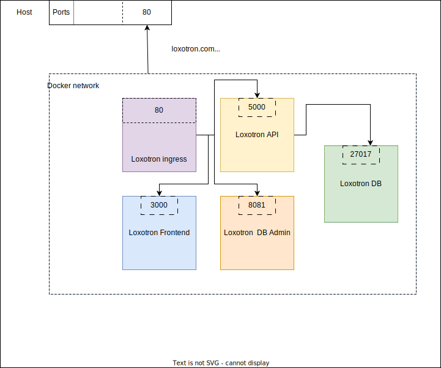

# Loxotron local infrastructure

Run Loxotron Casino locally on your machine and access using loxotron.com domain



## Requirements

* [docker-compose](https://docs.docker.com/compose/install/other/)
* [ansible-playbook](https://docs.ansible.com/ansible/latest/playbook_guide/playbooks_intro.html)

## Deployment

### Step One

Run docker compose to bring up all services

```console
user@hostname:infra/local$ docker compose build --no-cache
user@hostname:infra/local$ docker compose up
```

### Step Two

Update `/etc/hosts` to access services by domain names:
 * loxotron.com: Frontend
 * api.loxotron.com: Backend
 * admin.loxotron.com: Database admin page

```console
user@hostname:infra/local/ansible$ ansible-playbook -i inventory -e @setup.yaml main.yaml
```

### Step Three

Open your browser and access services by domain

## Cleanup

Roll back `/etc/hosts`

```console
user@hostname:infra/local/ansible$ ansible-playbook -i inventory -e @clean.yaml main.yaml
```
